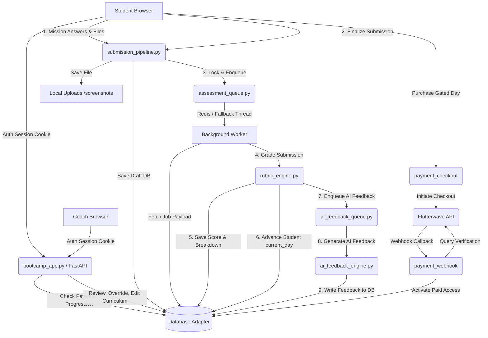

# Product Requirements Document (PRD) & Technical Architecture Map
**Project:** Dako Studios Bootcamp  
**Role:** Lead Systems Architect  
**Purpose:** AI Developer Agent Onboarding & Technical Blueprint  

---

## 1. The Bigger Plan (Vision & Core Objectives)

### 1.1 Ultimate Goal
The ultimate goal of the **Dako Studios Bootcamp** platform is to deliver a highly accessible, robust, and sequence-locked digital literacy curriculum to students who may be encountering computer systems, the internet, and modern digital tools for the first time. The curriculum spans a structured **20-day path** structured around daily practical missions:

*   **Days 1–5:** Computer and File System Fundamentals
*   **Days 6–10:** Internet, Search, Email, and Basic Documents
*   **Days 11–15:** Research, Cloud Storage, Video Conferencing, and Cybersecurity
*   **Days 16–20:** Passwords, Two-Factor Authentication, AI Tools, Prompt Engineering, and Portfolio Development

### 1.2 Core Problem Solved
1.  **Digital Literacy in Context:** Standard LMS platforms (Canvas, Moodle) are too complex for absolute beginners and assume prior understanding of computers. This platform offers a hyper-focused, distraction-free student portal utilizing localized African analogies (e.g., *M-Pesa, MTN MoMo, Danfo/Matatu transport, Naira/Cedi currencies*) to ground abstract hardware and software definitions.
2.  **Strict Progression Gating:** Students cannot "skip ahead" or skim. Progression requires submitting actual evidence of completed work (e.g., plain-text summaries or screen-capture uploads) which is programmatically scored or coach-reviewed before unlocking subsequent lessons.
3.  **Monetization & Financial Inclusion:** Integrates a flexible paywall model. Days 1–3 are free to reduce friction and build trust, while Days 4–20 are gated behind a payment ($49 USD equivalent) processed via **Flutterwave**, supporting cards, mobile money networks, and bank transfers native to sub-Saharan Africa.
4.  **Operational Simplicity & High Performance:** Built to support at least 100 concurrent active users on a single, low-cost virtual private server (VPS). By avoiding heavy frontend frameworks and complex ORMs, the application maintains zero-dependency simplicity and high performance.

---

## 2. Current State (Where We Are Now)

The codebase has completed several phases of development and represents a highly stable, transaction-safe monolithic backend. Below is the mapping of functional components vs. mock placeholders.

### 2.1 Fully Implemented & Wired Systems
*   **Unified Multi-Database Adapter (`db_adapter.py`):** Abstracts SQL operations across **SQLite** (using local journal WAL mode for performance) and **PostgreSQL** (using `psycopg` v3 for production scalability). It includes automated SQL rewriting proxies that dynamically convert dialects (e.g., mapping SQLite `INSERT OR REPLACE` to PG `ON CONFLICT DO UPDATE`, or mapping `BEGIN IMMEDIATE` to serializable transactions), preserving deterministic database behavior.
*   **Deterministic Progression & Submission Pipeline (`submission_pipeline.py`):** Handles student attempts, answers, and file uploads. Stream-reads and validates attachments (max 5MB, MIME restricted to PNG, JPEG, PDF) into unique names inside `uploads/screenshots/` and writes atomic DB updates.
*   **Deterministic Rubric Grading Engine (`rubric_engine.py`):** Executes grading calculations against structured rubrics. Supports automated boolean and length checks, scores subsections using weighted parameters, and updates student day progression if threshold is passed. Coaches can manually override scores with a mandatory reason, which is logged as an append-only audit trail.
*   **Deterministic Examination Engine (`exam_engine.py` & `assessment_session.py`):** Manages timed exams. Restricts attempts, enforces automatic time limits using backend sweeps (`sweep_expired_attempts`), autosaves answers to prevent data loss, and randomizes question and option layouts using a deterministic hash seed (a combination of exam, student, and attempt IDs).
*   **Dual-Core Job Queue (`assessment_queue.py` & `ai_feedback_queue.py`):** Runs heavy grading and feedback workloads in the background. Uses Redis for distributed queues with a fallback to thread-safe local in-memory queues (`FALLBACK_QUEUE`) and daemon workers. Implements lock/fence tokens (`fence_token = fence_token + 1`), lease timeouts (60 seconds), heartbeats, and retry bounds (max 3) to prevent job starvation or double-processing.
*   **Audit Logging System:** Emits deterministic structured JSON logging (e.g., `log_assessment_event`, `log_payment_event`, and `log_submission_event`) direct to `stdout` for centralized tracking, auditability, and observability.
*   **Admin/Coach Command Dashboards (`bootcamp_app.py`):** Provides a visual dashboard for coaches to view submissions, edit student records, modify curriculum, manage cohort seats and prices, retry queue tasks, and view payments.

### 2.2 Stubs, Mocks, and Work-in-Progress Areas
*   **AI Feedback Engine (`ai_feedback_engine.py`):** The function `generate_feedback` currently mocks latency using `time.sleep(2)` and generates static dummy text rather than calling an actual LLM (e.g. Claude or GPT) API.
*   **Lesson Content Generation (`generate_lessons.py`):** An offline utility designed to populate lesson HTML using Claude or a NotebookLM MCP server. This is not integrated dynamically into the application; lessons are seeded once in draft state, and changes must be pushed manually.
*   **Developer Mode Payment Bypasses:** In the absence of an explicit `FLUTTERWAVE_SECRET_KEY` env var, the application bypasses Flutterwave API validation, marking any checkout path as successful.
*   **Email Notification Layer:** The missions teach email etiquette and inbox management, but the platform does not possess a real SMTP mailer block to alert students or coaches on submission events.

---

## 3. Technical Architecture & Build Map

The system is architected as a **lightweight, single-node monolith** designed for maximum transaction safety and zero client-side dependencies.

### 3.1 Codebase Structure
```
.
├── bootcamp_app.py          # FastAPI Core Monolith (Routing, Auth, Views, Webhooks)
├── db_adapter.py            # Database Compatibility & Connection Pool Adapter
├── db_migration.py          # PG schema compiler, syntax parser, and seeder
├── dako_bootcamp_init_db.py # Local SQLite database schema and curriculum builder
├── submission_pipeline.py   # Student file uploading, validation, and serialization
├── rubric_engine.py         # Programmatic weighted evaluation of rubric rules
├── exam_engine.py           # Materializes random layouts, seeds, and option shuffles
├── assessment_session.py    # Exam timers, sweeps, autosaves, and locks
├── assessment_queue.py      # Background worker queue for grading (Redis / Threaded)
├── ai_feedback_queue.py     # Background worker queue for LLM feedback (Redis / Threaded)
├── ai_feedback_engine.py    # Mock/future interface for generating AI evaluations
├── worker.py                # Standalone Redis queue listener script
├── requirements.txt         # Package dependencies (FastAPI, Uvicorn, Psycopg, etc.)
└── data/
    └── bootcamp.db          # Default local SQLite database (WAL enabled)
```

### 3.2 Data Flow & System Interactions



### 3.3 Core Architectural Design Philosophies
1.  **Zero Front-End Build Step:** To ensure compatibility with low-powered client devices and eliminate developer build complexity, the application renders HTML directly from the server. Styling is handled via inline, semantic CSS embedded within `bootcamp_app.py` blocks.
2.  **No High-Level ORM:** The platform avoids heavy ORMs (such as SQLAlchemy or Django ORM). Instead, it runs optimized, raw SQL queries directly through connection proxies. This prevents N+1 query performance problems and makes transaction boundaries (`COMMIT`, `ROLLBACK`) completely transparent.
3.  **Strict Concurrency Safety:** High concurrent writes are handled by keeping database transactions short. Writing operations utilize SQLite's `BEGIN IMMEDIATE` lock to prevent deadlocks under write contention, while PostgreSQL handles transactions through native row locking.
4.  **Local Development Parity:** Standardized environment configurations (`.env`) swap between light-weight local development components (SQLite, Threaded Fallback Queue) and enterprise-ready cloud systems (PostgreSQL, Redis) without changing a single line of application-level business logic.

---

## 4. The Roadmap (Next Milestones)

Based on the differences between the current mocked subsystems and the broader vision, the immediate development milestones are:

### Milestone 1: Production AI Feedback Layer Integration
*   Transition `ai_feedback_engine.py` from mock data to real-time LLM integration using the **Anthropic API** (via `httpx`).
*   Design and test structured prompt templates that supply:
    1.  The student's submitted text.
    2.  The curriculum day instructions.
    3.  The grading breakdowns and rubric rules.
*   Enforce structured outputs (e.g. parsing XML/JSON schemas) to isolate strengths, weaknesses, and recommendations cleanly into DB columns.

### Milestone 2: Cloud Storage Abstraction Layer
*   Move away from local directory writes (`uploads/screenshots/`) which prevent deployment on stateless cloud systems (like Heroku or AWS ECS).
*   Implement a storage adapter interface (`StorageAdapter`) mapping files to local disk (dev mode) or cloud buckets (e.g., AWS S3, Cloudflare R2, Google Cloud Storage).
*   Refactor `bootcamp_app.py` upload retrieval to generate authenticated signed URLs for rendering student screenshots, preserving security.

### Milestone 3: Real-Time Logging Observability Dashboard
*   Expose the structured JSON log output natively on the Coach Ops Dashboard.
*   Build a lightweight log viewer that aggregates and formats errors, retries, and job times directly in the UI to simplify troubleshooting.

### Milestone 4: Webhook Security & Payment Reconciliation
*   Implement cryptographically secure webhook signature verification using `FLUTTERWAVE_WEBHOOK_SECRET` hashes.
*   Introduce an automated reconciliation background job that scans for `pending` transactions and queries the Flutterwave API to resolve any lost checkout requests.

---

## 5. Architectural Questions for Clarification

Before the final version of the PRD is signed off and development resumes, please clarify the following architectural choices:

1.  **Payment Verification Path:** Under transaction verification failures or network drops during a Flutterwave webhook callback, how long should the system wait before auto-retrying out-of-band reconciliations, and should payment state changes alert the coach via email/Slack notifications?
2.  **AI Feedback Policy:** Should students receive AI feedback immediately upon programmatic submission grading, or should feedback be held in a "draft" state until the coach approves it on the dashboard?
3.  **Authentication and Scale:** While session cookies currently work well for ~100 concurrent students, does the platform need support for single-sign-on (SSO) systems (e.g. Google Sign-In) or JWT-based stateless tokens to support future mobile app integrations?
